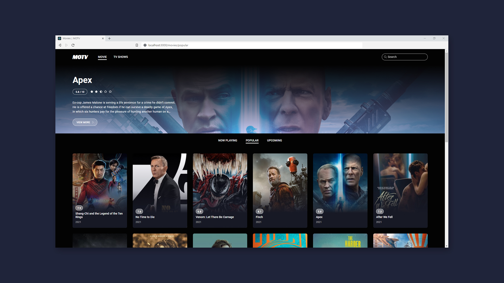
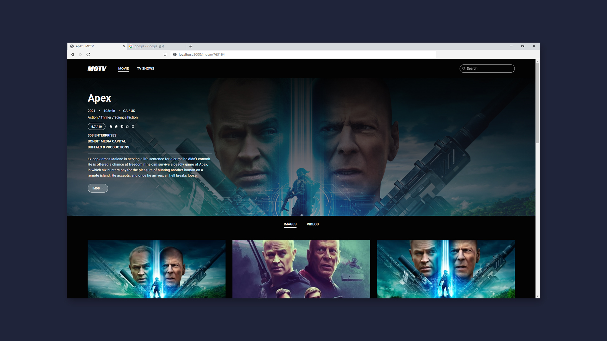
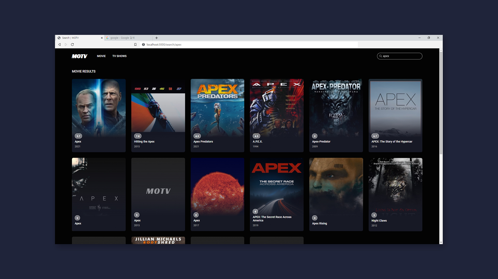
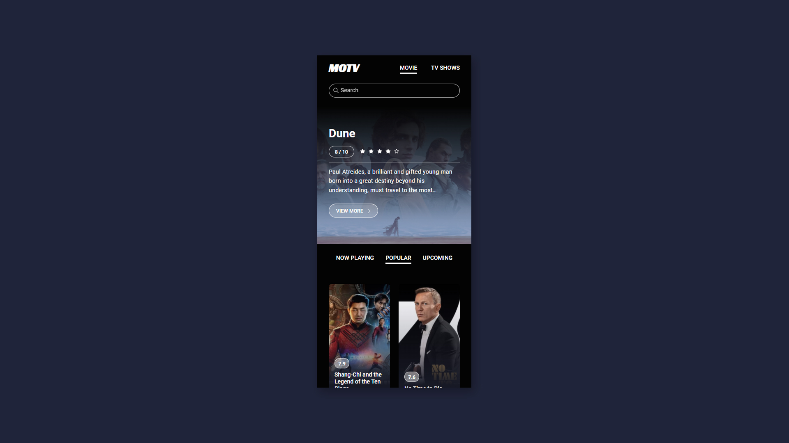
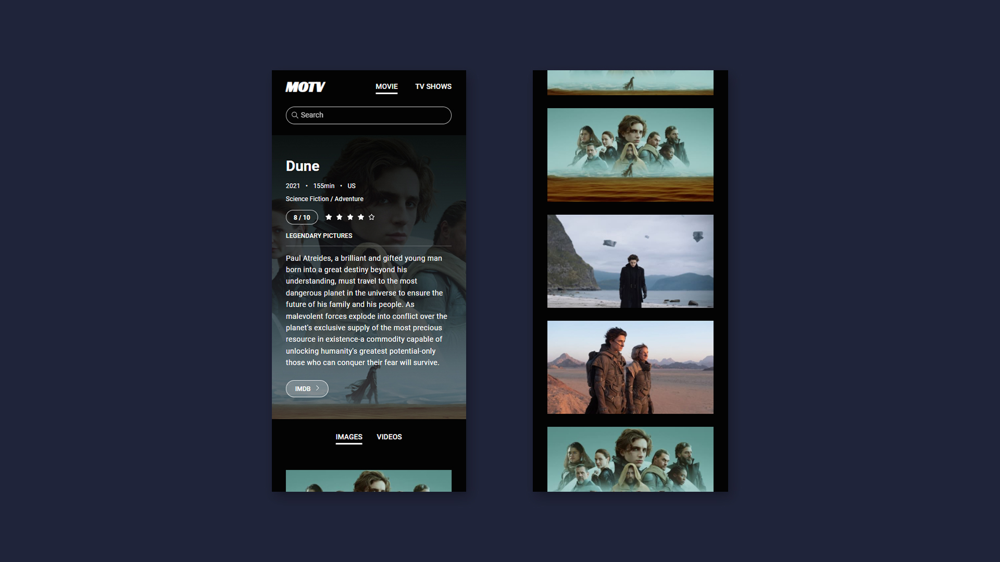
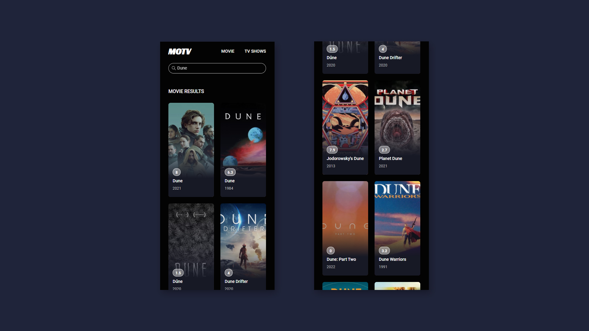

# MOTV

### 개요

React와 IMDB API를 활용한 영화,TV 프로그램 앱

### 목표

React의 활용한 기본적인 SPA 구현 및 반응형 UI 디자인

 

[>View Live](https://confident-clarke-58063e.netlify.app/)

 
 

### HOME - MOVIE / TV SHOWS - NOW PLAYTING / POPULAR / UPCOMING

 

### DETAILS - IMAGES / VIDEOS

 

### SEARCH

 

### HOME(MOBILE)

 

### DETAILS(MOBILE)

 

### SEARCH(MOBILE)

 
 

### 참고

**Container-Presenter Pattern**

- Medium Dan Abramov - [Presentational and Conatiner Components](https://medium.com/@dan_abramov/smart-and-dumb-components-7ca2f9a7c7d0)

 
